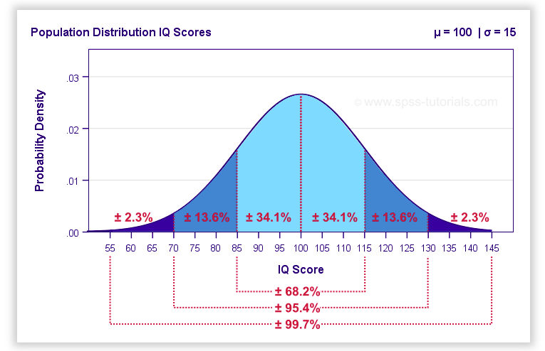

<!-- _class: title -->
<!-- _footer: '' -->
<!-- _paginate: false -->
# Using Marpit 
## ~~A tutorial~~ | Prof. Dr. Felix Zeidler
****
--- 
## Agenda

### Die folgenden Dinge werden in dieser Präsentation enthalten sein

1️⃣ Art der Hervorhebung von Text

2️⃣ Kapitelslides

3️⃣ Slides mit zwei Spalten

4️⃣ Tabellen und zentrieren von Objekten

5️⃣ Fußnoten und Quellenangaben
<br></br>

<div align='center'>
Auf geht's 😆
</div>

---
<!-- _class: chapter -->
<!-- _footer: '' -->
<!-- _paginate: false -->
# ~~1~~ Hervorhebung von Text 

---
# 1️⃣ Text 
## Wir können reguläre Markdown-Syntax nutzen, um Text hervorzuheben


Hier einige Beispiel:

- ein normaler Satz

- ein Satz mit einem **fetten** Wort

- ein Satz mit einem *kursiven* Wort

- ein Satz mit einem `code block`

- ein Satz mit einem ~~blauen Hintergrund~~

---
# 1️⃣ Text 
## Natürlich kann auch ein ganzer Block hervorgehoben werden...

> **Beispiel 1**: 
> Hier folgt ein langes Beispiel

<br></br>

### Das geht aber natürlich auch mit Code!

```python
# ein Kommentar

a = 13
b = 14
c = a * b
print(c)

>> 182
```

---
# 1️⃣ Text 
## Auch $Latex$ ist natürlich kein Problem

### Hier eine sehr komplexe Formel: 

$$
\begin{align*}
S(\omega) 
&= \frac{\alpha g^2}{\omega^5} e^{[ -0.74\bigl\{\frac{\omega U_\omega 19.5}{g}\bigr\}^{\!-4}\,]} \\
&= \frac{\alpha g^2}{\omega^5} \exp\Bigl[ -0.74\Bigl\{\frac{\omega U_\omega 19.5}{g}\Bigr\}^{\!-4}\,\Bigr] 
\end{align*}
$$
<br></br>

### Noch besser vielleicht eingebettet in einen Block?

> **Formel:** eine sehr komplexe Formel!
> $$\begin{align*}
S(\omega) 
&= \frac{\alpha g^2}{\omega^5} e^{[ -0.74\bigl\{\frac{\omega U_\omega 19.5}{g}\bigr\}^{\!-4}\,]} \\
&= \frac{\alpha g^2}{\omega^5} \exp\Bigl[ -0.74\Bigl\{\frac{\omega U_\omega 19.5}{g}\Bigr\}^{\!-4}\,\Bigr] \tag{1}
\end{align*} $$

---
<!-- _class: chapter -->
<!-- _footer: '' -->
<!-- _paginate: false -->
# Slides mit zwei Spalten

---
<!-- _footer: '' -->



<br></br>
#### Kommentar

Folgende Gründe sprechen dafür, dass es sich hier um eine Normalverteilung ($\approx N(\mu, \sigma)$) handelt. 

1. ....

2. ....

---
<!-- _class: chapter -->
<!-- _footer: '' -->
<!-- _paginate: false -->
# Zentrieren von Objekten

---
# Zentrierungen 
## Hier wird ein Text und eine Tabelle zentriert!
<div align='center'>
Dies ist ein zentrierter Text
</div>

<br></br>


<div align='center'>

| Header 1       	| Header 2       	|
|----------------	|----------------	|
| True negative  	| False negative 	|
| False negative 	| True positive  	|

</div>
<br></br>

Man kann auch sehr gut Fußnoten hinzufügen<sup>[1]</sup>. In diesem Fall muss man dann im Appendix ein Literaturverzeichnis manuell hinzufügen. 

Gut klappt allerings auch das hinzufügen von Quelle<sup>*</sup>

###### * die Information habe ich [hier](https://www.spiegel.de) gefunden

---
<!-- _class: lead -->
<!-- _backgroundColor: #5D5C61 -->
<!-- _color: white -->
<!-- _footer: '' -->
<!-- _paginate: false -->
##### Vielen Dank für die Aufmerksamkeit <!-- fit -->

---

### Kontaktdaten
<br></br>


📧  $\qquad$ felix.zeidler@gmail.com
☎️  $\qquad$ ...
❗ Dies ist ein Test!

🧠 Test

> **Exercise** :brain:
>
> We have **two** ~~different~~ customers. One of the customers wants to buy something. 
> <br></br>
> **❓ Question**
> What is the probability $P(X=3), \ \text{where} \ \forall x \in \mathbb{R}^+$


---
# Appendix 
## Pseudocode

> **Algorithm 1: Example-Algo** 
> Algorithm parameters: step size  $\alpha \in (0 , 1] , \epsilon > 0$   
Initialize  $Q  ( s, a ), \ \forall s \in S^+ , a \in A ( s ),$ arbitrarily except that $Q ( terminal , \cdot ) = 0$    
>
> $a \leftarrow 12$
> Loop for each episode:  
$\quad$Initialize $S$   
$\quad$Loop  for  each  step  of  episode:    
$\qquad$Choose  $A$ from $S$ using some policy derived from $Q$ (eg $\epsilon$-greedy)   
$\qquad$Take action $A$, observe $R, S'$   
$\qquad Q(S,A) \leftarrow Q(S,A) + \alpha[R+\gamma \max_a(S', a) - Q(S, A)]$   
$\qquad S \leftarrow S'$    
$\quad$ until $S$ is terminal


---
# Appendix B 
## Pseudocode im Codeblock?

```python
# Ein Kommentar: es folgt eine Funktion

def name_of_function(values: List[int]) -> Int:
    return np.sum(values)
```

---
<!-- _footer: '' -->


<br></br>
#### Erläuterungen
Abbildung zeigt Dichte einer Normalverteilung $\mathnormal{N(\mu, \sigma)}$. Diese zeichnet sich aus durch:

1. ....

2. dddd


---
# Chekc 
## Pseudocode for birthday problem

> **Algorithm:** Birthday Problem
>
> $\quad$ $initialize$ nsims
> $\quad$ sameday $\leftarrow$ 0
> $\quad$ npeople $\leftarrow$ 25
>
> $\quad$ **for** $1 \ldots$ nsims
> $\qquad$ allbirthdays $\leftarrow$ birthdays of npeople
> $\qquad$ uniquebirthdays $\leftarrow$ determine number of different birthdays
> $\qquad$ **if** *uniquebirthdays* **<** npeople
> $\qquad \quad$ sameday $\leftarrow$ +1
> 
> $\quad$ prob $\leftarrow$ sameday / nsims

<br></br>

<div align='center'>
What is your guess?
</div>

---


# Checks 
## Python code for birthday problem

Here is the code in **Python**

```python
import numpy as np 

nsims = 10000
sameday = 0
npeople = 25
for sim in range(nsims):
    birthdays = np.random.choice(range(365), n=npeople)
    unique_birthdays = np.unique(birthdays) # you can also use set(birthdays)
    if len(unique_birthdays) < npeople:
        sameday += 1
prob = sameday / nsims
```

**!** 

The above example is just *one* way how to translate the problem into code. There are numerous ways how to achieve this in Python. 

--- 
# Code 
## What we should have learned

Some new things, we introduced in **Python**:

- we can use `np.random.choice()` to sample from an array of elements (note that these could also be non-numerical)

- we can use `np.unique()` if we want to determine the number of unique elements (alternatively we could have used `set()`)

---
<!-- _class: mytable -->


# Chapter 01
## Eine Tabelle, die nicht gut formatiert ist!  

**Was wird das noch geben?**


| Header 1       	| Header 2       	| Header 3|
|:----------------	|:----------------	| :------------|
| True negative  	| False negative $f(x) = 3x \times 12 = 36x$	|
| False negative 	| True positive  	|
| False negative 	| True positive  	|
| False negative 	| True positive  	|
| False negative 	| True positive  	|Teste etwas !|
| False negative 	| True positive  	|


Die ist ein Test

| Heade  r 1 | Header 2 | Header 3|   
|------|------|-----|   
|A  |------|-----|   


---
# A 
## B

<style>
pre ol {
  all: unset;
  display: block;
  counter-reset: line-number 0;
}
pre ol li {
  all: unset;
  display: list-item;
  list-style: none;
}
pre ol li::before {
  content: counter(line-number) ": ";
  counter-increment: line-number;
}
</style>

```python
import numpy as np 

nsims = 10000
sameday = 0
npeople = 25
for sim in range(nsims):
    birthdays = np.random.choice(range(365), n=npeople)
    unique_birthdays = np.unique(birthdays) # you can also use set(birthdays)
    if len(unique_birthdays) < npeople:
        sameday += 1
prob = sameday / nsims
```

<div align='center'>
Some centered text!
</div>


npx @marp-team/marp-cli@latest --engine /Users/felix/Coding/marp/engine.js --theme https://raw.githubusercontent.com/fredzett/marp/master/custom.css --html examples.md -o output.pdf